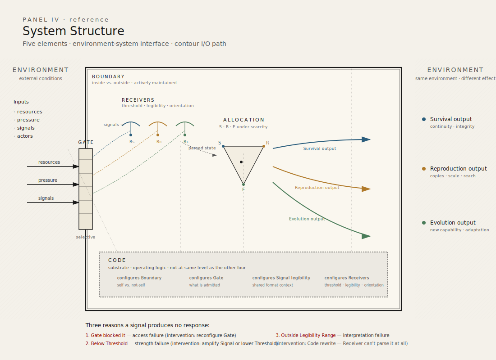

# System Structure

## System Elements

The model defined in the previous chapter — three contours, limited resources, environment, mediators — describes *what* is being allocated and *why*. This chapter describes *what the system is made of* structurally: the elements through which contour dynamics operate.

The model operates through five elements arranged in three groups:

- **Substrate:** Code
- **Structure:** Boundary, Gate
- **Dynamics:** Signal, Receiver

Code is foundational — it is not at the same level as the other four elements. It is the substrate that determines how each of the other four operates in a given system instance. Boundary and Gate define the system's shape and permeability. Signal and Receiver carry and interpret information about system state.

These five elements are the infrastructure of contour allocation. Without them, the model can name contours and state that resources are allocated — but cannot explain how allocation is structurally enacted, how information about contour state travels, or why the same pressure produces different responses in different systems.

---

## Substrate: Code

Code is the operating logic of a system. It defines what the system is, how it distinguishes itself from its environment, what it admits and rejects, what signals it can generate and interpret, and how it responds to pressure.

Code precedes and conditions all other elements:

- Boundary uses Code to distinguish inside from outside.
- Gate uses Code to determine what is permitted to cross.
- Signal is legible only within a shared Code context.
- Receiver is configured by Code to parse specific signal formats.

Code is not the same as narrative. Narrative is the expressed story — how Code is read, performed, and communicated by actors in a system. Code is the underlying logic being executed. The distinction matters: a system may change its narrative without changing its Code. When this occurs, the expressed story diverges from actual operating behavior — the system says one thing and does another. Durable system change requires change at the Code level, not only at the narrative level.

In human systems, Code manifests as shared beliefs about what the system is, what it exists to do, and what constitutes legitimate action within it. Code is not written down in any single document — it is distributed across the system's actors, practices, and institutional memory. It may be partially explicit (policy, charter, founding principles) and partially tacit (unwritten rules, inherited assumptions, cultural defaults).

Code can originate. A system's Code may be inherited from a predecessor (through Reconstitution, as defined in System Course), assembled from Code fragments carried by the system's founding elements, or emergent — arising when a self-sustaining pattern of resource allocation first establishes operating logic where none previously existed. The conditions and mechanisms of Code origination are defined in the dynamics layer of the model.

Code is rewritable. The conditions and mechanisms of Code rewriting are defined in the dynamics layer of the model.

---

## Structure: Boundary and Gate

### Boundary

Boundary defines inside and outside — what belongs to the system and what does not. It uses Code as its reference: what Code defines as self is inside the Boundary; what Code does not recognize is outside.

Boundary is not necessarily physical or spatial. In human systems, Boundary may be organizational (who is a member), contractual (who is party to an agreement), informational (what data is internal), or identity-based (what the system considers part of itself).

Boundary determines the scope of contour allocation. Resources inside the Boundary are subject to the system's allocation logic. Resources outside the Boundary are part of the environment. Boundary persistence is not passive — it requires continuous resource expenditure. A Boundary that appears static is actively maintained, and that maintenance is itself an allocation cost, a dynamic treated in detail in System Metabolism.

### Gate

Gate controls flow across Boundary. It governs what enters the system, what exits, and what is blocked — including resources, signals, actors, and information.

Gate is not binary. A Gate may be fully open, fully closed, or selectively permeable — admitting some flows while blocking others. Gate selectivity is configured by Code: what the system's operating logic defines as admissible passes through; what it defines as inadmissible is rejected.

Gate behavior shapes contour dynamics directly. A Gate that blocks signals about Evolution-relevant change prevents that information from reaching the system's allocation logic. A Gate that admits resources selectively may channel them toward one contour over others. Gate configuration is therefore a structural determinant of allocation posture — not merely a boundary mechanism.

---

## Dynamics: Signal and Receiver

### Signal

Signal transmits state-change information within the system or across its Boundary. A Signal carries information about contour state — distortion, pressure, opportunity, need — from one part of the system to another, or from the environment into the system.

A Signal is not inherently meaningful. Its meaning depends on the Code context within which it is received. The same Signal — the same information, in the same format — may produce a response in one system and no response in another, depending on whether the receiving system's Code makes that Signal legible.

### Receiver

A Receiver is an actor or subsystem configured by Code to detect, parse, and respond to specific signals. A Receiver has three properties:

**Threshold** is the minimum signal strength required to trigger a response. Signals below Threshold are present but produce no action — the Receiver does not activate.

**Legibility Range** is the set of signal formats the Receiver can parse, as defined by Code. Signals outside the Legibility Range are not blocked by a Gate or suppressed by insufficient strength — they are simply not recognized. The Receiver has no category for them. The Signal lands and is inert.

**Contour Orientation** determines which contours the Receiver is primed to monitor. A Receiver oriented toward Survival detects signals relevant to system viability and continuity. A Receiver oriented toward Evolution detects signals relevant to change and adaptation. Contour Orientation shapes what the Receiver is looking for, which in turn shapes what information reaches the system's allocation logic.

### Legibility

Legibility is not an element. It is a compatibility condition between Signal and Receiver — specifically, whether the Signal format falls within the Receiver's Legibility Range as defined by shared Code.

When a Signal is legible to a Receiver, it can be parsed and may produce a response (subject to Threshold). When a Signal is not legible, it produces no response — not because it was blocked, not because it was too weak, but because the Receiver cannot interpret it.

This distinction has diagnostic value. A system that fails to respond to a well-formed Signal may be doing so for three structurally different reasons: the Gate blocked the Signal (access failure), the Signal was below Threshold (strength failure), or the Receiver lacks the Legibility Range for that Signal format (interpretation failure). Each requires a different intervention.

---

## Contour Tensions

The three contours compete for the same limited resource pool. This competition produces three structural tensions, each describing a trade-off between two contours:

**Survival ↔ Evolution:** stability versus change. Resources allocated to preserving current viability are not available for transformation. Resources allocated to transformation reduce the system's capacity to maintain its current state.

**Survival ↔ Reproduction:** integrity versus scale. Resources allocated to protecting system quality and coherence are not available for expanding quantity or reach. Resources allocated to scaling reduce the system's capacity to maintain the integrity of what it already does.

**Reproduction ↔ Evolution:** copying versus changing. Resources allocated to propagating the current form are not available for developing a new one. Resources allocated to developing new capabilities reduce the system's capacity to replicate what currently works.

These tensions are structural — they arise from scarcity, not from conflict between actors. Even a well-governed system with aligned actors experiences these tensions, because allocation to one contour necessarily reduces what is available to others.

Tensions are not problems to solve. They are permanent features of any system operating under the model's applicability conditions. The model does not prescribe how tensions should be resolved — it describes the consequences of different resolution patterns.

---

## Contour Boundary Conditions

The three contours are analytically distinct at the level of primary functional intent. However, real-world activities frequently produce effects across multiple contours. Classifying an activity as primarily serving one contour requires identifying its primary intent — the functional demand it was undertaken to address.

Primary intent is the classification principle. An activity that scales existing output is Reproduction even if it incidentally improves process quality (a Survival effect). An activity that restructures a capability is Evolution even if it incidentally produces new output (a Reproduction effect).

Where primary intent is ambiguous, classification should be deferred until sufficient evidence is available. Premature classification produces interpretive drift. Detailed classification rules and discipline belong in the application layer of the model.

---

## Mediator Architecture

Mediators, introduced in the previous chapter as cross-cutting factors that shape allocation, operate through the element infrastructure defined above.

Mediators shape allocation by operating on elements:

- A mediator may configure or reconfigure **Gates** — determining what flows are admitted or blocked. Governance structures, for instance, control which signals reach decision-makers and which resources are released.
- A mediator may modify **Signal** propagation — amplifying, attenuating, or distorting signals as they travel through the system. Trust, for instance, determines whether a signal is treated as credible or dismissed.
- A mediator may influence **Receiver** orientation — shaping which contours the system's actors are primed to monitor. Power structures, for instance, may orient the system's Receivers predominantly toward Survival signals, reducing sensitivity to Evolution signals.
- A mediator may, over time, contribute to **Code** change — altering the system's operating logic. Institutional rules, accumulated precedent, and legitimacy structures all participate in shaping what the system treats as its foundational logic.

Mediators do not allocate resources directly. They shape the conditions under which allocation occurs. This is why they are cross-cutting rather than a fourth contour: they operate on the allocation mechanism, not within it.

### Mediator Configuration Properties

The preceding section defines what mediators do — operate on elements to shape allocation. This section defines how mediators differ structurally from one another. Two mediators may operate on the same element (both configuring Gates, for instance) and yet produce different allocation outcomes because their structural configuration differs. The configuration properties defined here determine the character of a mediator's effect, not merely its presence or absence.

Three configuration properties are defined.

**Selectivity** describes the pattern by which a mediator differentiates what it admits, amplifies, or blocks. Selectivity is not a scalar (more or less selective). It has a shape — the structural pattern that determines which flows, signals, or actors are treated differently.

A mediator with sharp selectivity draws clear distinctions: what passes the mediator's criteria is fully admitted, what does not is fully blocked, and the boundary between the two is narrow. Sharp selectivity produces concentrated, hierarchical allocation outcomes — resources flow into well-defined channels with clear jurisdictional boundaries. In human systems, a governance structure with many nested approval layers, strict jurisdictional boundaries, and binary pass/fail criteria exhibits sharp selectivity.

A mediator with smooth selectivity draws gradual distinctions: flows experience varying degrees of facilitation or resistance rather than binary admission or rejection, and the transition between facilitated and resisted is wide. Smooth selectivity produces distributed, diffuse allocation outcomes — resources flow along broad channels without sharp concentration points. In human systems, a governance structure with broad guidelines, few checkpoints, and gradient-based criteria exhibits smooth selectivity.

The distinction between sharp and smooth selectivity is not a value judgment. Sharp selectivity produces efficient local concentration — resources reach their destination with minimal diffusion. Smooth selectivity produces broad distribution — resources reach more destinations but with less concentration at any one. Which configuration is appropriate depends on the system's environmental conditions and contour demands, not on an inherent superiority of one pattern over the other.

**Resolution** describes the minimum scale at which a mediator operates. Every mediator has a characteristic scale below which it does not differentiate — flows, signals, or actors below this scale pass through the mediator's influence without being shaped by it.

Resolution defines a floor. Above the floor, the mediator's selectivity pattern applies — flows are admitted, blocked, amplified, or attenuated according to the mediator's configuration. Below the floor, the mediator is structurally absent — not because it has been removed, but because the flows at that scale are too fine-grained for the mediator's configuration to act on.

In human systems, resolution manifests as the granularity at which governance, trust, or power structures operate. An executive governance structure may have high resolution at the division level (shaping allocation across major units) and no resolution at the team level (individual team decisions pass below the governance floor). Trust may operate at high resolution between named individuals (shaping specific signal credibility) and low resolution at the institutional level (general institutional trust applying uniformly). The mediator exists at both scales, but its configuration only differentiates at one.

Resolution has diagnostic value. When a mediator appears ineffective — when it does not shape allocation as expected — the cause may be that the relevant flows operate below the mediator's resolution floor. The mediator is present but the activity is too fine-grained for it to act on. This is structurally distinct from a mediator being absent (not present at all) or blocked (present but overridden by a competing mediator). Each requires a different intervention: absence requires introducing the mediator, blocking requires addressing the competing mediator, and resolution mismatch requires either raising the mediator's resolution or aggregating the fine-grained flows to a scale the mediator can act on.

**Temporal behavior** describes whether a mediator's configuration is static or dynamic over the time horizons relevant to the system's metabolism.

A mediator with static temporal behavior maintains a constant configuration within the relevant time horizon. Its selectivity pattern and resolution do not change as the system operates. The Gate configurations it produces are stable — flows experience the same mediator influence at the beginning and end of the observation period.

A mediator with dynamic temporal behavior changes its configuration within the relevant time horizon. Its selectivity pattern, resolution, or both shift as the system operates. The Gate configurations it produces are time-dependent — flows experience different mediator influence at different points in the system's metabolic cycle.

Dynamic temporal behavior may be periodic (the configuration oscillates between states at a characteristic frequency), monotonic (the configuration shifts in one direction over time), or state-dependent (the configuration changes in response to specific system conditions). Each pattern produces different allocation consequences. Periodic mediator behavior produces rhythmic, pulsatile allocation patterns — resources flow differently at different phases of the cycle. Monotonic mediator behavior produces trending allocation patterns — the system's allocation posture drifts as the mediator reconfigures. State-dependent mediator behavior produces conditional allocation patterns — the system operates under one regime until a condition is met, then shifts to another.

The distinction between static and dynamic mediators is relative to the observation time horizon. A mediator that appears static at quarterly resolution may be dynamic at daily resolution. This is an instance of the Metabolic Frame Dependence defined in System Metabolism — the observed temporal behavior of a mediator depends on the temporal resolution of the observer's frame. Declaring a mediator's temporal behavior requires declaring the time horizon within which that behavior is assessed.

### Configuration and Allocation Consequences

The three configuration properties interact to produce the mediator's total effect on allocation. A mediator with sharp selectivity, high resolution, and static temporal behavior produces concentrated, fine-grained, stable allocation channeling. A mediator with smooth selectivity, low resolution, and dynamic temporal behavior produces distributed, coarse-grained, shifting allocation patterns.

Two systems identical in their contour demands, resource pools, and element infrastructure but different in mediator configuration will produce different allocation outcomes. This is the structural claim: mediator configuration is a determinant of allocation posture, independent of contour demand and resource availability. When diagnosis identifies allocation distortion, the cause may lie not in the contours or resources but in the mediator configuration that shapes how resources flow between them.

The specific configurations that produce specific allocation consequences are domain-dependent. Identifying which selectivity pattern, resolution level, and temporal behavior are operative in a given system is part of the diagnostic process and should be declared explicitly, following the same discipline required for proxy selection and comparability conditions.

---

## Environment–System Interface

The environment, defined in the previous chapter as external conditions shaping the system, interacts with the system through Boundary and Gate.

Environmental pressure reaches the system's allocation logic through a structural path: pressure changes conditions at the Boundary → Gate admits or blocks the resulting signals and resource flows → admitted signals reach Receivers → Receivers parse signals according to Code and contour orientation → parsed signals inform allocation decisions.

This path is not instantaneous or lossless. At each stage, information may be delayed, filtered, distorted, or blocked. Gate selectivity may prevent environmental signals from entering. Receiver Legibility Range may prevent entered signals from being parsed. Code may define certain environmental conditions as irrelevant.

The consequence is that a system's response to environmental change is not determined by the change itself — it is determined by how much of that change survives the path from Boundary to allocation decision. A system with open Gates, broad Receiver Legibility, and adaptive Code will respond to environmental shifts that a system with closed Gates, narrow Legibility, and rigid Code will not detect.
