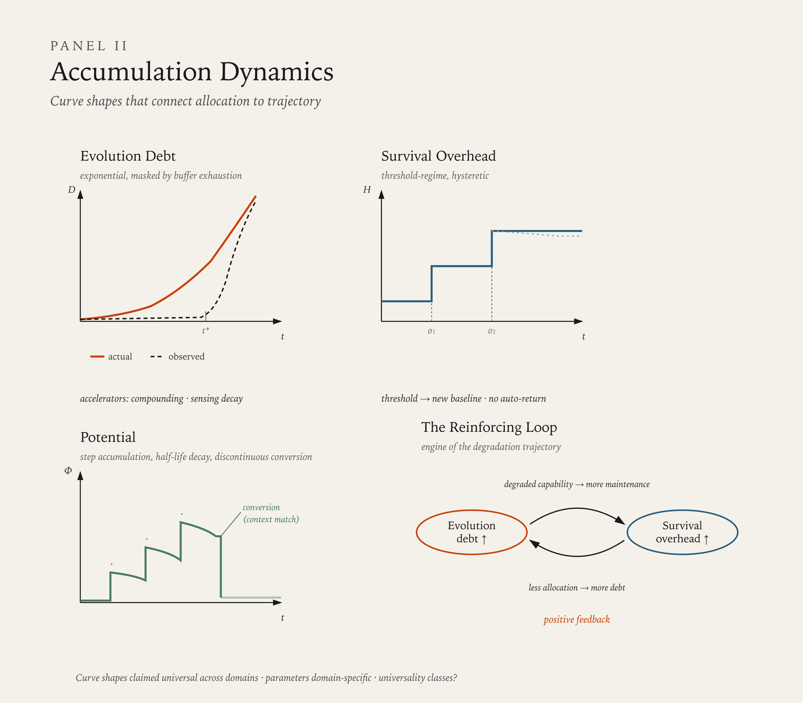

# System Metabolism

The previous chapters defined what the system is made of and how it behaves under pressure — how allocation shifts, how structure changes, how mechanisms operate. This chapter defines what happens when those mechanisms operate over time — how allocation produces accumulation, how accumulation produces trajectory, and how the temporal behavior of contour allocation becomes the primary observable for diagnosing system state.

System Dynamics describes mechanisms — what can happen. System Course describes trajectory — where the system goes. This chapter occupies the space between them: what accumulates, at what rate, and with what shape. Without this layer, the model can describe mechanisms and name trajectories but cannot explain why the same mechanism produces different trajectories in different systems, or why systems with identical structures at a single point in time produce divergent outcomes over time.

---

## Time

Time is not a model element. It is a universal constraint that the model inherits from physical reality.

Every metabolic act — every transformation of resources across or within contours — requires nonzero duration. A signal cannot propagate instantaneously. A gate cannot open and close without interval. A boundary cannot be maintained without continuous expenditure. No element of the model operates outside of time. This constraint is not a theoretical claim — it is a physical fact that applies to biological, organizational, and social systems alike.

The model does not define time. It uses time in a specific way: contour allocation over duration is the measurable substrate of system metabolism. Two systems identical in structure and dynamics but different in their allocation history over time are different systems with different predicted trajectories. The temporal record of allocation is not supplementary — it produces the accumulation values (debt, potential, overhead) that constitute the system's current metabolic state. It is the current state, not the history that produced it, that determines available trajectories. History is the normal and preferred evidence for estimating current state, but the dynamics operate on accumulation values regardless of how those values were produced.

Time operates in the model at two levels simultaneously. Continuous time is the background within which all system activity occurs. It flows regardless of whether anything changes. A system sitting in unchanged allocation for a year has experienced a year of continuous time — and that duration has consequences, because the environment has changed even if the system has not. Event-driven time marks the discrete moments when metabolic state changes — a contour allocation shifts, a conversion occurs, a synchronization event happens. Continuous time answers when something occurs or how long a state persists. Event-driven time answers what changed and in what sequence.

Both levels are always present. Accumulation dynamics — debt, potential, overhead — operate in continuous time. They grow or decay whether or not discrete events occur. Conversion dynamics — the transition from accumulated potential to productive output — are event-driven. They happen at specific moments, triggered by specific conditions.

### Time and the Element Infrastructure

All elements defined in System Structure operate within time, but their relationship to time differs.

Code is the element most directly subject to temporal dynamics. Code accumulates — drift adds incremental change over time. Code degrades — operating logic that was viable under prior conditions becomes progressively less viable as conditions change. Code transforms — rewrite produces discontinuous change at specific moments. The temporal state of Code — what has accumulated, what has degraded, what has been rewritten and when — constitutes the system's metabolic record.

Narrative, defined in System Dynamics as the expressed story of Code, operates at a different temporal speed. Narrative can change nearly instantaneously — a new strategy announcement, a revised mission statement, a leadership speech. Code changes at metabolic rates — constrained by the actual transformation of operating logic, practices, and institutional behavior. The gap between Narrative speed and Code speed is itself a diagnostic indicator. When the gap is large — Narrative has changed but Code has not — the system is producing divergence, not transformation. When Narrative and Code change at comparable rates, transformation is genuine.

Boundary requires continuous maintenance — it persists only because the system expends resources to sustain it. This maintenance is a metabolic cost. A boundary that appears static is actively sustained; the time invested in that sustenance is Survival-contour allocation.

### Time and Contour Behavior

The three contours impose distinct temporal properties on any activity they govern. This is not a claim that activities inherently have fixed temporal properties — it is a claim that the contour an activity serves shapes its temporal behavior.

Survival imposes urgency and non-deferrability. An activity serving Survival operates under the shortest tolerable cycle — production incidents are resolved immediately, payroll is processed without delay, infrastructure is maintained before failure. Survival-contour time is characterized by the inability to postpone without immediate consequence.

Reproduction imposes cyclicality and predictable throughput. An activity serving Reproduction operates within a recognizable rhythm — delivery cadences, release cycles, hiring rounds, planning periods. The period scales with the complexity of what is being reproduced, but the cycle shape is consistent.

Evolution imposes latency and stochastic return. An activity serving Evolution operates without a guaranteed timeline or deterministic outcome — learning accumulates over unpredictable durations, experiments produce results that may or may not convert to capability, and the interval between investment and return is characteristically longer than for the other two contours.

These temporal properties have diagnostic value. An activity's actual contour can be identified by observing its temporal behavior, independent of how it is labeled. A "learning initiative" that operates on tight deadlines with predictable deliverables exhibits Reproduction-contour temporal properties — it is Reproduction, regardless of its name. A code review that proceeds without time pressure and explores unfamiliar architectural patterns exhibits Evolution-contour temporal properties — it is Evolution investment, regardless of whether it appears on a delivery timeline.

### Metabolic Frame Dependence

The preceding sections establish time as the medium through which allocation is enacted and accumulation occurs. They treat time as uniform — a shared background within which all observers and all parts of the system experience the same duration. This is a sufficient assumption for most applications of the model. It is not a universal one.

Metabolic Frame Dependence is the condition where the observed metabolic rate of a system varies depending on the observer's structural relationship to the system. The same system, undergoing the same allocation dynamics, presents different apparent metabolic rates to observers positioned differently relative to its structure.

Frame dependence arises from two sources.

**Structural position** determines what metabolic activity is visible to an observer. An observer positioned at the system's Boundary sees flows crossing in and out — resource acquisition, output delivery, environmental signal exchange. An observer positioned at the system's allocation logic sees contour trade-offs, displacement decisions, feedback processing. An observer positioned at a single element — one Gate, one Receiver, one subsystem — sees the metabolic activity that passes through that element. Each position produces a different apparent metabolic rate, because each position makes different subsets of the system's total metabolic activity observable.

This is not a measurement limitation that better instrumentation could resolve. It is a structural property of observation. A system's total metabolic activity is distributed across its elements, and no single observation point captures all of it. The metabolic rate measured from any given position is a real measurement of a real subset of the system's metabolism — but it is a subset, not the whole.

**Temporal resolution** determines what metabolic patterns are visible to an observer. An observer sampling system state at quarterly intervals sees a different metabolic signature than an observer sampling daily. The quarterly observer detects slow accumulation dynamics — overhead ratcheting, debt growth, potential decay — but cannot resolve the event-driven dynamics that occur between samples. The daily observer detects operational allocation patterns — Survival urgency cycles, Reproduction throughput rhythms — but may miss the slow accumulation trends that are only visible at longer intervals. Both observers are measuring real metabolic activity. Neither has the complete picture.

The combination of structural position and temporal resolution defines an observer's metabolic frame. The same system observed from different frames presents different apparent metabolic states — and both observations are accurate within their frame.

Frame dependence has diagnostic consequences. When two observers of the same system disagree about its metabolic state — one perceiving health while the other perceives stress — the disagreement may not indicate that one observer is wrong. It may indicate that each observer's frame reveals different aspects of the system's metabolism. A board observing quarterly financial metrics may perceive Flow. An engineering team observing daily delivery dynamics may perceive Starvation. Both are correct within their frame. The system's actual metabolic state includes both observations — the financial stability seen at quarterly resolution and the capability erosion seen at daily resolution.

The model's diagnostic claims — about accumulation, about metabolic signatures, about trajectory prediction — are frame-dependent claims unless the observation frame is declared. An assertion that a system is in Starvation is an assertion from a specific structural position at a specific temporal resolution. The same system observed from a different frame may present a different signature. This does not make the diagnosis invalid — it makes the diagnosis positional. Diagnostic discipline requires declaring the frame: where the observation is positioned, at what temporal resolution, and what subset of metabolic activity that frame makes visible. Without frame declaration, two valid diagnoses of the same system may appear contradictory when they are in fact complementary.

The model's primary application domain — human organizations — typically operates within frames that are close enough to be treated as shared. Actors within the same organization experience approximately the same temporal flow and have access to overlapping subsets of metabolic activity. Frame dependence becomes consequential when the observation gap between frames is large: board versus engineering, headquarters versus field, investor versus operator. In these cases, frame dependence explains disagreements about system state that cannot be resolved by better data — they can only be resolved by integrating observations across frames.

The model does not prescribe a privileged frame. No observation position is inherently superior to another. Each frame reveals real metabolic activity that other frames may not capture. What the model requires is frame declaration — making explicit which position and which resolution an observation uses, so that frame-dependent observations can be compared, integrated, or recognized as complementary rather than contradictory.

Frame dependence operates in two modes that require different diagnostic approaches.

**Quantitative frame dependence** is the mode described above. Different frames observe the same metabolic process at different apparent rates. The process is identified identically from all frames — observers agree on what is happening but disagree on how fast or how much. A board and an engineering team may both identify that Evolution debt is accumulating, but the board perceives it as gradual (quarterly sampling misses the event-driven dynamics) while engineering perceives it as rapid (daily exposure to the operational consequences). The disagreement is about magnitude and urgency, not about the nature of the process. Frame integration in this mode is rate reconciliation — combining observations to establish the process's actual rate across the full temporal and structural range.

**Qualitative frame dependence** is the mode where different frames observe what appears to be different metabolic processes entirely. The disagreement is not about rate but about the nature of what is occurring. A board observing quarterly strategic metrics may perceive Evolution-contour investment — new market positioning, capability development, strategic transformation. An engineering team observing daily delivery dynamics may perceive Survival-contour firefighting — incident response, technical debt management, infrastructure patching. These are not different rates of the same process. They are different processes — different contour activities, different metabolic signatures, different trajectories — observed from different structural positions within the same system.

Qualitative frame dependence arises when a system's metabolic activity is structurally differentiated across its elements — when different parts of the system are doing different things, and each observer's frame captures a different part. The board's frame captures the strategic layer (where Evolution-coded activity occurs). Engineering's frame captures the operational layer (where Survival-coded activity occurs). Both are real. Neither is the whole picture. The system is simultaneously investing in Evolution at the strategic layer and firefighting for Survival at the operational layer — and neither observer sees both.

The diagnostic discipline for qualitative frame dependence differs from the quantitative mode. Rate reconciliation is insufficient — the observers are not measuring the same thing at different rates. What is required is process reconciliation: identifying which metabolic processes are occurring at which structural positions, and constructing a composite metabolic description that includes all of them. The composite may reveal that the system's metabolic state is internally contradictory — Evolution investment at one layer coexisting with Survival crisis at another — in a way that no single-frame observation captures.

Qualitative frame dependence also explains a class of intervention failures. An intervention designed from one frame's metabolic diagnosis may be structurally correct for the process visible from that frame and structurally irrelevant or counterproductive for the process visible from another. A board that perceives Evolution investment and intervenes to accelerate it may inadvertently increase the Survival crisis visible only to engineering — because the Evolution investment at the strategic layer generates additional operational load at the delivery layer. The intervention is coherent within its frame and destructive across frames. Effective intervention under qualitative frame dependence requires composite diagnosis before action.

---

## Metabolism

Metabolism is the process by which a system sustains itself through the continuous transformation of inputs across contours over time. The term is adopted from biology, where metabolism denotes the set of life-sustaining reactions through which organisms convert energy, build structure, and respond to their environments. The adoption is not metaphorical — it identifies the same structural phenomenon at a different scale: a bounded system maintaining a non-equilibrium state through ongoing resource transformation.

A system with no metabolic activity — no resource transformation across contours over time — is inert. It is not a living system in the model's terms. The model's applicability conditions (limited resources, competing demands, non-static behavior) are metabolic conditions: they describe a system that is actively transforming resources under contour competition.

Metabolism operates on Code, not on Narrative. The metabolic state of a system is determined by what is actually being transformed — what resources are actually allocated to which contours, what capabilities are actually being built or degraded, what buffers are actually being consumed. Narrative may describe a different metabolic state than the one that exists. Measurement of metabolism requires observation of Code-level activity, not narrative-level claims.

---

## Accumulation

The central claim of this chapter is that contour allocation over time produces accumulation — quantities that grow, decay, or transform as a consequence of sustained allocation patterns. Accumulation is what connects mechanism to trajectory: the mechanisms defined in System Dynamics produce allocation patterns; those patterns, sustained over time, produce accumulations; those accumulations determine which trajectories defined in System Course are available.

Three types of accumulation are defined. They follow different dynamics, are measured in different units, and interact with each other in ways that produce compound effects.

### Debt

Debt is the accumulation produced by sustained under-allocation to a contour. When a contour receives less than what is required to maintain its functional capacity, debt accumulates — the gap between what the system can do and what its environment requires grows over time.

Debt is not an abstraction. It manifests as concrete capability loss: skills that atrophy, tools that become obsolete, relationships that decay, infrastructure that degrades, institutional knowledge that dissipates.

**Evolution debt** accumulates when the system under-invests in adaptation, learning, and capability change. Its characteristic curve is approximately exponential with a perception delay. Three mechanisms drive the acceleration:

Environmental change compounds. The environment does not change at a constant rate — new technologies enable further technologies, competitors who have adapted create additional pressure, regulatory and market conditions shift in response to shifts. The distance the system must travel to close the gap grows faster than linearly because the destination is itself moving.

Sensing capacity degrades. The longer a system operates without Evolution investment, the less capable it becomes of recognizing what it is missing. The receivers and actors that would detect the gap — people with current knowledge, processes that surface external developments, gate configurations that admit environmental signals — atrophy through the same under-allocation that produced the debt. The system progressively underestimates its own debt.

Compensation buffers exhaust. Early Evolution debt is often masked by existing buffers — experienced individuals who carry institutional capability, established tools that continue to function, client relationships that tolerate declining adaptive capacity. These buffers are finite. As they deplete, the debt that was always present becomes suddenly visible. The debt was accumulating gradually; its appearance is sudden. This dynamic — gradual accumulation, sudden visibility — is structurally identical to the compensation mechanism defined in System Dynamics, operating at the temporal scale.

The combined effect is a curve that appears flat for an extended period (while buffers mask and sensing degrades) and then rises steeply (when buffers exhaust and the accumulated gap becomes undeniable). From inside the system, this trajectory is experienced as a sudden crisis. From outside, the curve was climbing throughout.

The unit of Evolution debt is adaptation cost — the effort required to close the gap between current capability and environmental demand, measured from the system's current position. Adaptation cost captures the compounding dynamic: as infrastructure degrades and sensing capacity diminishes, the cost of closing the gap grows faster than the gap itself.

**Survival debt** accumulates when the system under-invests in maintaining its current viability — deferring infrastructure maintenance, under-resourcing operational functions, neglecting the sustenance of existing commitments. Its characteristic curve is approximately linear in accumulation but step-function in consequence.

Each unit of deferred maintenance adds roughly comparable additional debt. Unlike Evolution debt, Survival debt does not characteristically accelerate through compounding — a month of deferred server maintenance adds approximately the same risk as the previous month. However, the consequences of Survival debt are not proportional — they are threshold-based. The system functions adequately until a threshold is crossed, then fails abruptly. A server runs until it doesn't. Staff tolerate conditions until they don't. Compliance holds until it doesn't.

The unit of Survival debt is failure proximity — the distance between current accumulated debt and the nearest consequence threshold.

**Reproduction debt** accumulates when the system suspends productive output for an extended period. The machinery of Reproduction — delivery coordination, release discipline, quality judgment under time pressure, trade-off intuition — degrades through disuse. Its characteristic curve is logarithmic decay of readiness: initial pause produces minimal impact, with each additional unit of inactivity adding diminishing additional degradation.

Reproduction debt does not produce the catastrophic failure associated with Survival debt or the exponential divergence of Evolution debt. It produces increasing restart cost — the system becomes progressively rustier, and resuming productive output requires rebuilding coordination and rhythm from a degraded base.

The unit of Reproduction debt is restart cost — the effort required to resume productive output at a level comparable to the system's prior capacity.

### Potential

Potential is the accumulation produced by Evolution-contour investment that has not yet converted to Reproduction-contour output. Learning that has occurred but not been applied. Capability that has been developed but not deployed. Adaptive capacity that exists but has not been activated by a Reproduction context.

Potential accumulates in steps, not continuously. Each significant learning event, exposure to a new domain, or capability development effort creates a discrete increment of potential. Between events, potential does not grow — it persists or decays.

Potential has a half-life. Unconverted potential does not persist indefinitely. Deep structural understanding — foundational models, architectural intuition, systemic insight — decays slowly. Specific technical fluency — tool-specific knowledge, implementation patterns, domain-current awareness — decays faster. The half-life varies by depth: the more foundational the potential, the longer it persists without activation.

Conversion of potential to productive output is discontinuous. Potential does not flow gradually into Reproduction — it converts when a threshold is crossed. The threshold has two components:

Accumulated potential — sufficient learning, capability, or adaptive capacity must exist to be activated.

Context readiness — a Reproduction-contour opportunity must exist that matches the stored capability. Context readiness is external to the unit that holds the potential. A person who has learned deeply cannot force conversion — they require a project, a role, a problem that needs what they have built. An organization that has invested in new capabilities cannot force their deployment — it requires a market condition, a client need, or an internal demand that activates the investment.

Conversion, when it occurs, is characteristically disproportionate to the apparent input. The system invests over an extended period with no visible output change, then produces a rapid capability shift that appears sudden to observers. The investment was gradual; the conversion is discontinuous. This is the temporal inverse of the compensation-exhaustion pattern: where compensation masks gradual debt until sudden visibility, potential masks gradual investment until sudden conversion.

The unit of potential is conversion readiness — how much of the stored capability can be activated given an appropriate context.

### Overhead

Overhead is the allocation share claimed by Survival-contour activity. It is not inherently pathological — every system requires Survival allocation to maintain viability. Overhead becomes consequential when it grows beyond what Survival functionally requires, crowding out Reproduction and Evolution allocation.

Overhead does not grow linearly under stress. It exhibits threshold-regime dynamics. Below a stress threshold, Survival allocation is proportional to the threat and reversible when the threat subsides. Above the threshold, the system shifts to a new allocation regime — Survival claims a larger fixed share that persists even after the stressor diminishes.

This persistence is a ratchet effect. Once Survival overhead increases beyond a threshold, it does not automatically return to baseline. In biological systems, chronic stress recalibrates the hormonal stress response to a new baseline that does not self-correct. In human organizations, crisis-era processes — additional reporting requirements, tighter approval chains, expanded compliance checks — persist as permanent overhead long after the crisis that justified them has passed. The overhead becomes structural.

Returning to a lower overhead regime requires active, deliberate intervention — not merely the removal of the original stressor. The system must dismantle the overhead mechanisms that were built during the stress period. This dismantling is itself resisted, because existing Code has incorporated the elevated overhead as normal operating logic.

The unit of overhead is allocation share — the fraction of total system resources claimed by Survival-contour activity. This is directly measurable through time allocation, budget distribution, and attention patterns.

---

## Accumulation Interactions

The three accumulation types do not operate independently. They interact through reinforcing and masking dynamics that produce compound effects.

### The Reinforcing Loop: Debt and Overhead

Evolution debt and Survival overhead form a reinforcing loop that is the most dangerous compound dynamic in the model.

As Evolution debt grows, the system's capability falls behind its environment's demands. Maintaining existing commitments with degrading capability requires more effort — more workarounds, more manual intervention, more crisis management. This additional effort is Survival-contour allocation. Overhead increases.

As overhead increases, the allocation available for Evolution decreases further. Less Evolution investment accelerates debt accumulation. More debt drives more overhead. The loop feeds itself.

This reinforcing loop is the structural mechanism underlying the degradation sequence defined in System Course. Distortion (initial displacement of Evolution) produces stress (accumulating debt generates overhead) produces degradation (the loop accelerates, consuming the system's capacity). The degradation sequence describes the trajectory; the debt-overhead loop describes the engine that drives it.

### Masking: Potential as Debt Buffer

Accumulated potential can mask growing debt. A system with capable, experienced actors — people who have invested in Evolution historically — can sustain performance levels that its current allocation does not support. The actors' stored potential absorbs the gap, functioning as a compensation buffer.

This masking is structurally identical to the compensation mechanism defined in System Dynamics, with potential serving as the buffer. It is finite. The actors' potential is consumed — applied to maintaining current output rather than converted to new capability. When these actors depart or their potential decays, the masked debt becomes visible.

This pattern — a system sustaining itself by metabolizing its own accumulated potential as Survival fuel — is analogous to biological catabolism under starvation, where the organism breaks down its own structural tissue for energy. The system survives longer but becomes progressively less viable.

---

## Metabolic Signatures

The accumulation dynamics defined above — debt, potential, overhead, and their interactions — produce characteristic observable patterns when sustained over time. These patterns recur across domains and are recognizable without formal quantitative measurement. They are defined here as metabolic signatures.

A metabolic signature is a recognizable configuration of contour dominance and accumulation profile that recurs across systems and predicts a characteristic trajectory. Signatures are identified through two axes: which contour dominates allocation (or whether allocation is balanced), and which accumulation type is primary (what is growing, decaying, or being consumed).

Contour dominance alone does not uniquely identify a signature. Two systems may both be Survival-dominant but exhibit structurally different metabolic states depending on what is accumulating beneath the surface. The accumulation profile is required as a secondary axis to complete the identification.

Six signatures are defined below. These represent the most common configurations arising from the model's accumulation dynamics. They are not exhaustive — additional signatures can be constructed by extending the same two-axis logic with additional dimensions, as described in the Application layer of the model.

### Starvation

Contour profile: Survival-dominant. Accumulation profile: Evolution debt accumulating without buffer.

The system produces using only existing capability. No resources are allocated to adaptation, learning, or capability change. Output is sustained through the repetition of known patterns.

Starvation is not a temporary crisis response — it is a sustained metabolic regime in which Evolution-contour allocation has ceased without a restoration trajectory. The system is not deferring Evolution investment — it has stopped making it.

The characteristic trajectory is the debt-overhead reinforcing loop defined in Accumulation Interactions. Evolution debt grows exponentially (compounding environment, degrading sensing capacity, exhausting buffers). Overhead increases as maintaining commitments with degrading capability requires more effort. The loop accelerates toward degradation and breakdown.

Observable indicators: delivery conversations reference only known solutions; technical decisions default to precedent without awareness that alternatives exist; no latency-type activity is visible — no one is doing anything whose return is uncertain or distant; when environmental change demands adaptation, the system's response is slow and expensive because no adaptive infrastructure exists.

### Borrowed Life

Contour profile: Survival-dominant. Accumulation profile: Evolution debt masked by consumption of accumulated potential.

The system sustains output levels that its current allocation cannot support. The gap between actual allocation and observable output is absorbed by specific actors whose historically accumulated potential functions as a compensation buffer. The system is Survival-dominant in its allocation but does not appear to be — because the buffer actors maintain output quality that exceeds what the system's current investment would produce.

Borrowed Life is structurally distinct from Starvation. In Starvation, Evolution debt is visible in degrading output. In Borrowed Life, the same debt is invisible because stored potential masks it. The distinction matters because the diagnostic path is different: Starvation is identifiable from output quality; Borrowed Life requires identifying the buffer actors and recognizing that the system's viability depends on their finite, non-replenished capacity.

The characteristic trajectory is apparent stability followed by sudden transition. While buffer actors are present, the system appears functional. When they depart — or when their potential is fully consumed — the accumulated debt becomes visible simultaneously, producing a rapid shift to visible Starvation or direct entry to degradation. The transition speed is the diagnostic marker: a system that degrades suddenly after specific departures was in Borrowed Life, not in health.

Observable indicators: a small number of individuals are disproportionately referenced in decisions and problem-solving; knowledge is concentrated rather than distributed; output quality varies in patterns that map to individual involvement; succession planning is absent or produces anxiety when raised; the buffer actors themselves exhibit stress signals disproportionate to their formal role scope.

### Fermentation

Contour profile: Evolution-loaded. Accumulation profile: potential accumulated without conversion context.

The system has invested in Evolution — learning has occurred, capability has been developed, adaptive capacity has been built. But the investment has not converted to Reproduction-contour output because no Reproduction context exists that matches the accumulated potential.

Fermentation is not pathological by default. It is a pre-conversion state that may be productive — potential will convert when context arrives — or may be wasteful — potential will decay without ever converting. The signature describes the metabolic state, not the outcome.

The characteristic trajectory has two exits. Conversion: a Reproduction-contour opportunity appears that matches accumulated potential, producing rapid and disproportionate output — the investment was gradual, the conversion is sudden. Decay: no context appears within the potential's half-life, and the system transitions toward reduced metabolic activity as accumulated learning degrades without activation.

The critical variable is context readiness, which is external to the fermenting system. The system cannot force conversion — it can only sustain potential until a matching context arrives or accept decay if none does.

Observable indicators: actors describe high engagement with learning and frustration with application; prototypes and experiments are abundant, shipped products are scarce; conversations are rich in possibility and thin on commitment; no delivery rhythm is present — activity is internally motivated and open-ended; the system feels intellectually alive but organizationally inert.

### Flow

Contour profile: balanced — no single contour dominant. Accumulation profile: debts minimal, feedback functional.

All three contours receive allocation sufficient to maintain their functional capacity. Evolution investment converts to Reproduction output within recognizable cycles. Survival maintenance is adequate without crowding out the other contours. Feedback loops are open — signals about all three contours reach the system's allocation logic.

Flow is a specific metabolic state, not a generic description of health. It requires active conditions: functional feedback across all contours, Evolution investment that converts regularly, Survival maintenance that remains proportional, and allocation trade-offs that are explicit and managed. These conditions are demanding. Most systems are not in Flow most of the time.

The characteristic trajectory is sustained viability with adaptive capacity. Flow does not prevent degradation — it provides the adaptive capacity to respond to pressure without immediately entering the debt-overhead reinforcing loop. The most common exit from Flow is through environmental shock that forces Survival-dominant allocation, displacing Evolution first. A system that was in Flow before a shock has more capacity to recover than a system that was already in Starvation or Borrowed Life.

Observable indicators: Evolution investment is visible in Reproduction output within the same operational cycle — learning translates to improved delivery in real time; actors describe challenge without overwhelm; feedback operates bidirectionally — Survival concerns are heard, Reproduction commitments are realistic, Evolution investment is protected but accountable; the temporal signature is layered — Survival maintenance rhythms, Reproduction delivery cycles, and Evolution investment latency coexist without one crowding out the others; trade-offs are explicit and discussed, not hidden or denied.

### Proliferation

Contour profile: Reproduction-dominant. Accumulation profile: Survival debt and Evolution debt accumulating simultaneously.

The system scales its existing form — expanding reach, increasing quantity, replicating patterns — without maintaining what it has or developing new capability. Growth proceeds without proportional investment in integrity or adaptation.

Proliferation maps to Reproduction-Dominant Distortion defined in System Course. The metabolic dimension adds what is accumulating beneath the growth: dual debt in both Survival and Evolution contours. The distortion pattern describes the posture; the metabolic signature describes the cost that is building.

The characteristic trajectory is deceptively stable. Growth metrics reinforce the allocation pattern through the feedback loop described in System Course — visible success metrics encourage further Reproduction allocation. Survival debt accumulates linearly until a threshold. Evolution debt accumulates exponentially. When either threshold is crossed — an infrastructure failure, a quality crisis, a market shift that demands adaptation the system cannot produce — the accumulated dual debt surfaces across multiple dimensions simultaneously. The system that was growing enters degradation or breakdown rapidly because it has no adaptive capacity and its maintenance infrastructure has been neglected.

Observable indicators: growth metrics dominate all reporting and conversation — headcount, revenue, market share, output volume; quality signals are present but deferred — "we'll address that after we scale"; new units replicate existing patterns including their weaknesses — no differentiation, no local adaptation; the temporal signature is accelerating Reproduction cyclicality without corresponding Survival maintenance rhythms or Evolution latency; infrastructure complaints increase but are treated as operational noise.

### Churn

Contour profile: Evolution-dominant. Accumulation profile: no stable potential — each capability investment is replaced before it matures.

The system transforms constantly. Architecture changes, methodology shifts, strategic pivots, technology replacements — all occur at high frequency. But no investment is sustained long enough to stabilize into usable capability. Potential does not accumulate because each Evolution cycle resets rather than builds on the previous one.

Churn is structurally distinct from Fermentation. In Fermentation, potential accumulates and awaits a conversion context. In Churn, potential does not accumulate because no investment persists long enough to mature. The system is Evolution-dominant but Evolution-unproductive.

The characteristic trajectory is chronic underperformance without acute failure. Survival is adequate — the system does not collapse. Reproduction is intermittent and below the system's potential. Evolution activity is high-energy but low-yield. The system can sustain Churn for extended periods because it does not accumulate debt in the catastrophic patterns of Starvation or Proliferation. What it accumulates is opportunity cost — the growing gap between what the system could have achieved with sustained investment and what it actually achieved through constant reset.

The exit from Churn requires a Code-level intervention: the system's operating logic must be rewritten to value consolidation and sustained investment. This is difficult because Churn-culture actors often have high personal Evolution-contour orientation and interpret consolidation as stagnation.

Observable indicators: architecture, technology stack, or methodology changes with high frequency — each change justified by compelling reasoning, none sustained long enough to prove or disprove its value; actors describe fatigue rather than excitement about change; institutional knowledge is thin because nothing persists long enough to become institutional; the temporal signature is characterized by absence of both Reproduction cyclicality and Evolution latency — activity is intense but each cycle resets; the system cannot answer "what have we learned?" because each learning is overwritten by the next initiative.

---

## Open Questions

This chapter establishes the foundational dynamics of accumulation and their metabolic signatures. Several areas require further development and are acknowledged as open.

**Additional signatures.** The six signatures defined above are the most common configurations. Additional signatures can be constructed from the same two-axis logic — contour dominance and accumulation profile — extended with additional dimensions such as relational context, temporal oscillation patterns, or metabolic intensity. The construction of domain-specific signatures belongs in the Application layer.

**Quantification.** The accumulation curves defined in this chapter have specified shapes (exponential, linear, logarithmic, threshold-regime) but not specified parameters. The shapes hold cross-domain; the rates are domain-specific. Establishing measurement approaches for specific application domains — particularly human organizations — is required for the model to move from qualitative diagnosis to quantitative prediction.

**Signature transitions.** The signatures describe metabolic states. The transitions between signatures — how a system moves from Flow to Starvation, or from Fermentation to Flow — are implied by the trajectory descriptions but not formalized as transition dynamics. Whether predictable transition sequences exist, and under what conditions transitions are reversible, requires further development.

**Endogenous Phase Transition thresholds.** The Endogenous Phase Transition mechanism defined in System Dynamics identifies internal accumulation thresholds as triggers for discontinuous allocation shifts. The accumulation dynamics defined in this chapter — debt curves, overhead ratchets, potential decay — are the substrates that approach those thresholds. Formalizing which accumulation profiles produce Endogenous Phase Transitions, what threshold shapes are characteristic for each accumulation type, and whether transition thresholds can be estimated from observable accumulation rates, requires further development. The connection is structural: the mechanism is defined in System Dynamics; the accumulation that drives it is defined here; the formalized relationship between them remains open.
