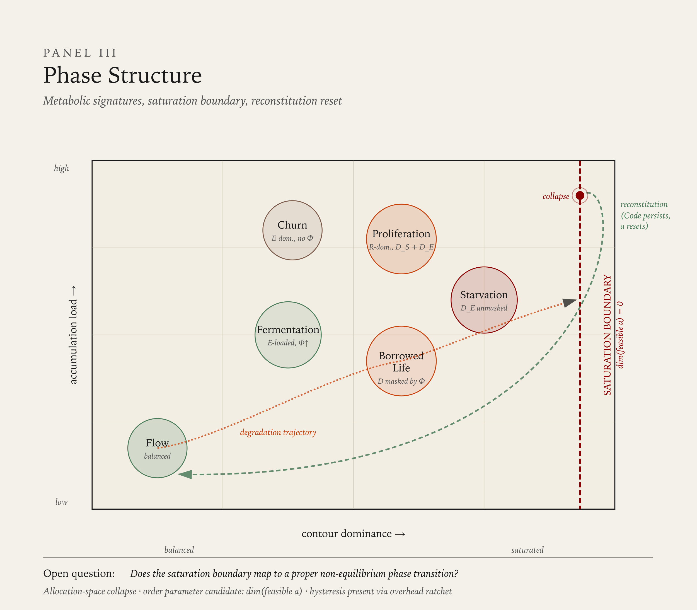

# System Course

The previous chapters defined what the system is made of, how it behaves under pressure, and what accumulates when those behaviors are sustained over time. This chapter defines the trajectories that result — how systems degrade, how they fail, and how they recover or transform.

System course is not predetermined. A system under stress may correct and return to its prior balance. It may reorganize around a new balance. It may transform into a structurally different system. Or it may collapse. The model does not predict which outcome occurs — it describes the structural conditions that make each outcome more or less available.

The degradation sequence defined in this chapter is a diagnostic tool, not a prophecy. It names the stages a system passes through under sustained distortion, and at each stage identifies the structural choices available — correction, adaptation, transformation, or continued deterioration. System Metabolism provides the accumulation dynamics that drive progression through these stages — what is building beneath the surface at each point, and what determines how rapidly the system moves from one stage to the next.

---

## Distortion

Distortion is the state where allocation between contours deviates from the system's prior balance. It is the entry point for all subsequent system course trajectories.

Distortion is produced by displacement — one contour receiving less allocation to serve another, as defined in System Dynamics. Distortion is not inherently pathological. A system may distort deliberately, accepting temporary imbalance to address a specific pressure. Distortion becomes consequential when it persists without a restoration trajectory.

At the metabolic level, distortion is the point at which debt begins to accumulate in the under-allocated contour. The accumulation is below observable threshold — the system's output has not visibly changed. But the temporal record has begun: the gap between current capability and environmental demand is growing, even if no actor in the system can yet detect it.

At distortion, the system's structural choice is: **correct the allocation or continue**. If corrected — through reallocation, environmental change, or deliberate intervention — the system returns to its prior balance or establishes a new one. If uncorrected, distortion produces stress.

---

## Stress

Stress is the state where sustained distortion begins to produce observable tension within the system. The system is still functional, but the consequences of imbalanced allocation are accumulating.

Stress manifests through the element infrastructure defined in System Structure. Signals about contour imbalance increase in frequency and intensity. Receivers oriented toward the under-allocated contour activate more often. Actors within the system begin to experience trade-offs as recurring rather than occasional.

At the metabolic level, debt accumulation has crossed a detection threshold — the system's signals now carry information about contour imbalance. Overhead may begin to increase as maintaining existing commitments with reduced capability requires additional effort. The debt-overhead reinforcing loop defined in System Metabolism may be initiating, though its effects are not yet dominant.

Stress may be masked by compensation — buffer expenditure absorbing the gap between expected and actual contour output. When compensation is active, the system may appear less stressed than it is. The stress is present; its visibility is reduced. Accumulated potential in experienced actors may function as a compensation buffer, producing the Borrowed Life metabolic signature — apparent stability sustained by finite, non-replenished capacity.

At stress, the system's structural choice is: **reallocate or compensate**. Reallocation addresses the underlying distortion. Compensation defers its consequences. Both are viable responses — but they lead to different trajectories. Reallocation can resolve stress. Compensation sustains it at the cost of buffer margin.

---

## Degradation

Degradation is the state where sustained stress has begun to reduce the system's functional capacity. The system is not merely imbalanced — it is losing capability in the under-allocated contour.

The distinction between stress and degradation is: stress produces tension within a functioning system; degradation produces loss of function. A stressed system can still perform across all contours, though not at its prior level. A degrading system is losing the ability to perform in one or more contours.

At the metabolic level, the debt-overhead reinforcing loop defined in System Metabolism is active. Accumulated debt is producing measurable capability loss, and maintaining commitments with degrading capability drives Survival overhead higher, which further reduces the allocation available for the under-invested contour. The loop accelerates itself. If potential-as-buffer masking was present during the stress stage, it may be approaching exhaustion — the actors whose stored potential was absorbing the gap are departing or depleting.

Degradation is often the first stage visible to external observers. Internal actors may have experienced stress for an extended period — making trade-off decisions, watching signals escalate, feeling compensation pressure. External observers see degradation when output quality, system coherence, or adaptive capacity visibly decline.

At degradation, the system's structural choice is: **restructure or persist**. Restructuring means reorganizing allocation, potentially changing the system's operating priorities, to arrest the loss of function. Persisting means continuing the current pattern, which leads to further capacity loss. Restructuring at this stage is more costly than reallocation at the stress stage — it requires changing patterns that have become established during the stress period.

---

## Breakdown

Breakdown is the state where the system can no longer sustain its prior contour balance under any reallocation. The capacity lost during degradation cannot be restored through redistribution of existing resources.

Breakdown is a threshold — the point where return to the prior state ceases to be available. Before breakdown, the system can recover its earlier balance through sufficient reallocation. After breakdown, the prior balance is structurally unavailable. The resources, capabilities, or conditions that sustained it have been consumed, lost, or irreversibly altered.

At the metabolic level, accumulated debt has exceeded the system's recovery capacity. The reinforcing loop has consumed the system's adaptive margin — the overhead required to maintain Survival under degraded capability now structurally prevents the reallocation that recovery would require. Overhead has ratcheted to a new regime and will not return to its prior level without active dismantling.

Breakdown does not mean the system ceases to function. It means the system cannot function as it did before. The system that continues past breakdown is operating under a different set of constraints than the system that entered the degradation sequence.

At breakdown, the system's structural choice is: **transform or deteriorate further**. Transformation means establishing a new contour balance — different from the prior one, but viable under current conditions. This may involve Code rewrite, boundary redefinition, or fundamental reallocation of priorities. Deterioration means continuing without establishing a new viable balance, which leads toward failure.

---

## Failure

Failure is the state where the system can no longer maintain viability across its contour functions. The system is unable to sustain Survival, Reproduction, and Evolution at levels sufficient to continue operating as a coherent system.

Failure does not require that all contours cease simultaneously. A system may fail because one contour has collapsed entirely while others continue — but the loss of that contour makes the system as a whole non-viable. A system that cannot evolve in a changing environment will eventually fail to survive, even if Survival allocation is currently adequate.

At failure, the system's structural choice is: **reconstitute under new terms or collapse**. Reconstitution means the system's components, actors, or resources reorganize into a new system — with new Code, new Boundaries, potentially new contour priorities. The new system is not a continuation of the old one — it is a successor that inherits some of the old system's elements. Collapse means the system ceases to function as a system. Its resources disperse, its Boundary dissolves, and its contour allocation ceases.

---

## Collapse

Collapse is the terminal state. The system ceases to exist as a bounded entity with contour allocation. Resources that were inside the Boundary return to the environment. Actors that were part of the system become independent or join other systems. The system's Code may persist as cultural memory, institutional precedent, or inherited assumption — but the system itself no longer operates.

Collapse is rare as an endpoint. Most systems exit the degradation sequence before reaching collapse — through correction, restructuring, or transformation at earlier stages. Collapse typically requires that all available choices at prior stages were either unavailable or not taken, and that the system's environment did not provide conditions for reconstitution.

---

## Recovery, Transformation, and Reconstitution

The degradation sequence is not a one-way path. At each stage, the system has structural choices that can arrest the progression, reverse it, or redirect it.

**Recovery** is the return to a prior or comparable contour balance. Recovery is available at distortion, stress, and degradation — the stages where the system's prior capacity has not yet been irreversibly lost. Recovery becomes progressively more costly at each stage: correcting distortion requires reallocation; resolving stress may require reallocation plus unwinding compensation patterns; arresting degradation may require restructuring established patterns.

The progressive cost of recovery is driven by accumulation dynamics defined in System Metabolism. At each stage, the system carries more accumulated debt, has consumed more potential as buffer, and may have ratcheted Survival overhead to a higher regime. These accumulations do not reverse automatically when the decision to recover is made — they must be actively addressed. Debt must be closed through renewed investment. Consumed potential must be rebuilt. Ratcheted overhead must be deliberately dismantled. The later the stage, the greater the accumulated burden and the more costly the recovery.

**Rebalancing** is the establishment of a new contour balance that differs from the prior one but is viable under current conditions. Rebalancing is available at any stage, including breakdown. A system that cannot return to its prior balance may stabilize around a different one — allocating differently across contours, operating at a different scale, or serving different functions. Rebalancing is not failure — it is adaptation to changed conditions.

**Transformation** is structural change to the system itself — Code rewrite, Boundary redefinition, fundamental change to the system's operating logic. Transformation is distinct from recovery (which restores the prior system) and from rebalancing (which adjusts allocation within the existing system). Transformation produces a different system — one that shares elements with its predecessor but operates on different Code.

Transformation is most available during breakdown and boundary dissolution — states where the system's prior structure has already lost its hold and resistance to structural change is reduced. Transformation during earlier stages is possible but faces greater resistance, because the system's existing Code, Gates, and Receivers are still configured to reject structural change.

**Reconstitution** is the formation of a new system from the dispersed elements of a collapsed one. Reconstitution is available only after collapse — it is the exit path that the other three responses cannot provide, because at collapse the system itself no longer exists as an entity capable of recovering, rebalancing, or transforming. What reconstitutes is not the system but its elements — resources, actors, and persisting Code fragments — reorganizing into a new bounded system under new allocation conditions.

Reconstitution is structurally distinct from transformation. Transformation changes the system from within — the system persists as a bounded entity throughout the process, even as its Code, Boundaries, and allocation logic change. Reconstitution occurs after the Boundary has dissolved and the system has ceased to operate. There is no continuity of system identity. The successor system inherits elements from its predecessor but is a new system, not a modified version of the old one.

Reconstitution has three structural components:

**Code persistence** — some portion of the collapsed system's Code survives as an organizing principle for the successor. Not all Code persists. Code that was specific to the prior system's allocation pattern — its particular Gate configurations, its particular Receiver orientations, its particular Boundary definitions — typically does not survive, because these were products of the system's specific structure. Code that was foundational — the operating logic that defined what the system fundamentally was, what it recognized as legitimate, what rules governed its internal dynamics — may persist, because this level of Code is not dependent on a specific allocation pattern. It is the logic that any allocation pattern within the system operated on. What persists is determined by Code depth: shallow Code (specific practices, particular configurations) disperses with the system. Deep Code (foundational logic, governing rules, structural principles) may survive as inherited organizing logic in the successor. The persistence of deep Code is not automatic — it requires that the dispersed elements carry it and that the reconstitution context activates it. Deep Code that is carried but never activated in a successor system decays over time, following the half-life dynamics defined for potential in System Metabolism.

**Allocation reset** — the successor system begins with a new allocation pattern. It does not inherit the collapsed system's contour posture. This is structurally necessary: the collapsed system's allocation pattern was the proximate cause of its trajectory through the degradation sequence. If the successor inherited that pattern, it would inherit the trajectory. Reconstitution produces a viable successor precisely because the allocation constraints of the prior system do not carry forward. The successor faces its own environmental conditions and establishes its own contour balance — potentially a very different one from what its predecessor sustained.

**Reconstitution context** — the conditions under which elements reassemble determine what kind of successor system forms. The same set of dispersed elements can produce different successor systems depending on what environmental conditions exist at the moment of reconstitution, which Code fragments are activated, and what new elements from the environment are incorporated during reassembly. Reconstitution is not deterministic — the same collapse can produce different successors under different conditions.

Reconstitution connects to Contour Saturation as defined in System Dynamics. When a system reaches Saturation — one contour consuming the entire allocation space, the other two displaced to zero with demands persisting at nonzero levels — the exit path is not reallocation (no degrees of freedom remain) but system reconstitution. Saturation drives the system through failure and collapse at a rate determined by how rapidly the unbounded displacement pressure exceeds the system's structural containment capacity. What follows is reconstitution or terminal collapse, depending on whether persisting Code and dispersed elements find a viable reconstitution context.

When reconstitution occurs repeatedly — a system collapses, reconstitutes, traverses a trajectory, collapses again, and reconstitutes again — a cyclic pattern may emerge. The model does not claim that cycles are universal or inevitable. It claims that when they occur, each cycle is governed by persisting deep Code but begins with a reset allocation pattern. Across cycles, the persisting Code itself is subject to drift — the same mechanism defined for Code change in System Dynamics. Each collapse-reconstitution event is a potential site for Code modification: the conditions of collapse may alter which Code fragments persist, and the reconstitution context may activate Code in a modified form. Over multiple cycles, this drift may produce systematic change in the successor systems — each governed by recognizably similar but not identical deep Code. Whether cyclic reconstitution produces convergent drift (successors becoming progressively more similar), divergent drift (successors becoming progressively more different), or stable replication (no systematic drift) depends on the specific dynamics of the collapse-reconstitution interface and the environmental conditions across cycles. Formalizing these dynamics — transition conditions, drift rates, cycle stability — is an open question for further development.

**The relationship between failure and transformation:** a system that fails is not necessarily a system that dies. Failure means the current system configuration is no longer viable. What follows depends on whether the system's components can reorganize. If they can — under new Code, with new Boundaries — a successor system emerges. If they cannot, collapse follows. Many of the systems that appear to have survived catastrophic failure have actually transformed — the entity persists, but the system operating within it is structurally new.

---

## Distortion Patterns

When displacement persists and one contour chronically receives disproportionate allocation, the system develops a characteristic distortion pattern. Three patterns correspond to the three contours.

These patterns describe the allocation posture — which contour dominates and what structural consequences follow. The metabolic consequences of sustained distortion — what accumulates beneath the posture, at what rate, and with what observable indicators — are defined as metabolic signatures in System Metabolism. Distortion patterns and metabolic signatures are complementary: the pattern names the posture; the signature names what is building as a result.

### Survival-Dominant Distortion

The system allocates disproportionately to preserving current viability at the expense of scaling and adaptation. Resources flow to protection, control, stability, and continuity. Reproduction and Evolution are chronically under-allocated.

Structural consequences: the system becomes rigid. Its Gate configuration tightens — fewer signals are admitted, fewer flows cross the Boundary. Its Receivers narrow toward Survival-relevant signals, reducing sensitivity to Evolution and Reproduction signals. Its Code reinforces existing operating logic and resists rewrite. The system survives but does not grow or change.

This pattern is self-reinforcing through feedback: rigidity reduces adaptive capacity, which increases perceived threat, which reinforces Survival allocation.

### Reproduction-Dominant Distortion

The system allocates disproportionately to scaling, copying, and propagating its existing form at the expense of integrity and adaptation. Resources flow to growth, replication, and expansion. Survival and Evolution are chronically under-allocated.

Structural consequences: the system grows but becomes brittle. Quality degrades as scale increases without proportional investment in integrity. Weaknesses in the existing form are propagated rather than corrected. The system's Code prioritizes throughput over coherence. Adaptation is deferred because changing the form would slow replication.

This pattern is self-reinforcing through feedback: growth produces visible success metrics, which reinforces Reproduction allocation, which further defers investment in the Survival and Evolution contours that would address the growing structural fragility.

### Evolution-Dominant Distortion

The system allocates disproportionately to transformation, experimentation, and capability change at the expense of stability and scale. Resources flow to learning, restructuring, and innovation. Survival and Reproduction are chronically under-allocated.

Structural consequences: the system changes constantly but does not stabilize or scale. Each new capability is abandoned before it matures. Operational reliability declines because continuity receives insufficient investment. The system's Code favors novelty over consolidation. What works is not preserved or propagated — it is replaced by the next experiment.

This pattern is self-reinforcing through feedback: constant change produces a sense of progress, which reinforces Evolution allocation, which further defers the Survival and Reproduction investment needed to consolidate and sustain what has been developed.

---

## Element Failure Modes

System elements defined in System Structure can fail individually. Each element has characteristic failure modes — ways in which it ceases to perform its structural function.

### Code Failure

**Corruption** — Code becomes internally inconsistent. Different parts of the system operate on contradictory logic. Boundary, Gate, Signal, and Receiver are configured by conflicting instructions, producing incoherent system behavior.

**Drift** — Code changes gradually and unintentionally, departing from the logic that made the system viable without any deliberate decision to change. The system slowly becomes something it did not intend to become.

**Conflict** — multiple Codes coexist within the same system Boundary. This occurs when systems merge, when subunits develop independent operating logic, or when Code rewrite is partial — changing some elements while others retain the prior Code.

### Boundary Failure

**Impermeability** — Boundary blocks all flow in both directions. The system is isolated from its environment. No signals enter, no resources flow, no feedback reaches the allocation logic. The system operates on stale information and depleting internal resources.

**Dissolution** — Boundary ceases to distinguish inside from outside. The system loses its identity as a bounded entity. Resources, actors, and signals flow freely in all directions without structural control.

**Misidentification** — Boundary misclassifies inside as outside or outside as inside. The system treats its own productive elements as threats (expelling value-generating actors) or treats external threats as internal resources (admitting destructive flows).

### Gate Failure

**Permanent open** — Gate admits all flows without selection. The system is flooded with signals, resources, and actors that its Receivers and allocation logic cannot process.

**Permanent closed** — Gate blocks all flows. The system is cut off from specific resource or signal channels regardless of their relevance or value.

**Miscalibration** — Gate admits what should be blocked and blocks what should be admitted. Selection criteria no longer match the system's actual needs. This is distinct from Boundary misidentification — the Boundary correctly defines inside and outside, but the Gate applies wrong criteria to flows crossing it.

### Signal Failure

**Noise** — Signal channel carries information that does not correspond to actual system state. Receivers activate on false signals, producing allocation responses to non-existent conditions.

**Attenuation** — Signal weakens as it travels through the system, arriving at Receivers below Threshold. The information exists but does not trigger response.

**Distortion** — Signal is altered during transmission, arriving at Receivers with changed content. The Receiver responds, but to information that does not match the original state-change event.

**Flooding** — Signal volume exceeds Receiver processing capacity. Relevant signals are lost in volume. The system cannot distinguish important state-change information from routine transmission.

### Receiver Failure

**Threshold miscalibration** — Receiver triggers at inappropriate signal strength. Too low: the Receiver responds to noise, producing constant false activation. Too high: the Receiver fails to respond to genuine signals, producing blindness to real state changes.

**Legibility narrowing** — Receiver's legibility range contracts, reducing the set of signal formats it can parse. Signals that were previously legible become inert. The system progressively loses the ability to interpret information from parts of its own operation or environment.

**Orientation lock-in** — Receiver becomes fixed on a single contour orientation, losing sensitivity to signals from other contours. A Receiver locked on Survival signals ceases to detect Evolution-relevant information, regardless of signal strength or format.

---

## Compound Failure Patterns

Individual element failures frequently co-occur and interact, producing compound patterns with distinct characteristics. Three patterns are identified from case analysis. Additional patterns may exist — this set is not claimed as exhaustive.

### Self-Attack

The system's own protective mechanisms target productive internal elements. Boundary misidentification (classifying inside as outside) combines with Gate miscalibration (admitting action against internal elements) and Receiver orientation lock-in (monitoring only for threat signals).

The system optimizes against itself — expelling actors, suppressing signals, or dismantling capabilities that are structurally valuable but that the system's distorted Code identifies as threats. The more productive the targeted element, the more aggressively the pattern escalates.

### Unregulated Replication

A system function escapes the constraints that normally regulate its scale. Reproduction-contour activity proceeds without Survival-contour accountability or Evolution-contour input. Gate failure (permanent open on the replication channel) combines with Receiver orientation lock-in (monitoring only Reproduction metrics) and feedback distortion (growth signals amplified, integrity signals attenuated).

The system scales its existing form without constraint — propagating current patterns including their weaknesses. Growth metrics remain strong while structural fragility accumulates beneath them.

### Signal Isolation

Information stops propagating through the system. Gate failure (permanent closed on signal channels) combines with Signal attenuation and Receiver legibility narrowing. The system's upper and lower levels, or its internal and boundary-facing functions, lose the ability to communicate.

Actors generating signals about system state — distortion, stress, degradation — find that their signals do not reach the allocation logic. Actors making allocation decisions operate on stale or absent information. The system fragments into locally functional but systemically disconnected regions.
